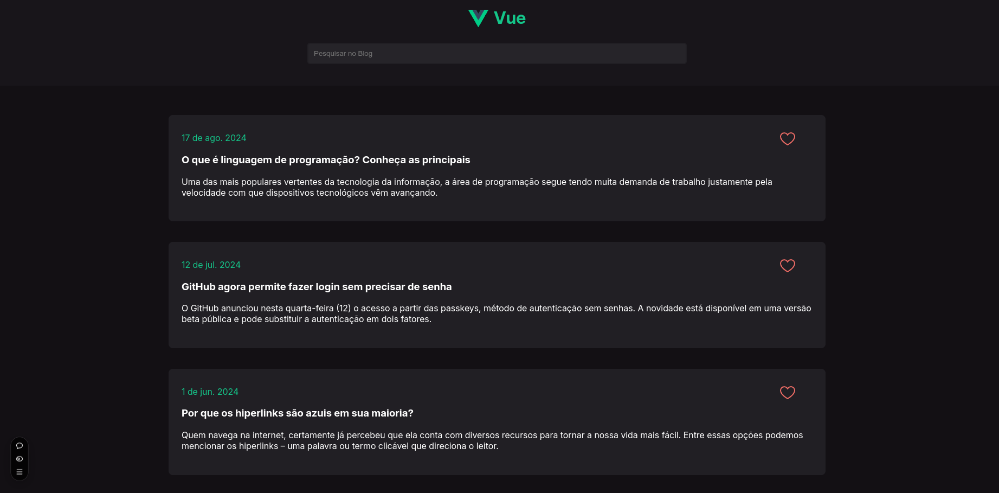

# Primeiro projeto Vue

Este projeto foi criado para realizar o desafio proposto na Formação Front-End(Vue+React) do Vai Na Web.
O desafio consistia em reproduzir as interfaces deste **<a href="https://www.figma.com/design/Yb9IBH56g7T1hdIyZ3BMNO/Desafios---CodeLab?node-id=0-1&node-type=canvas&t=eyjdNNz9S1CYd6KY-0" target="_blank">Figma</a>**:



Com algumas modificações no estilo para se adequar ao VueJs

### Ajustes e melhorias

O projeto ainda pode melhorar muito, por isso esses são alguns ajustes e melhorias que eu pretendo implementar:

- [ ] Adicionar responsividade ao projeto

## 🚀 Começando

Essas instruções permitirão que você obtenha uma cópia do projeto em operação na sua máquina local para fins de desenvolvimento e teste.

Consulte **[Instalação](#-instalação)** para saber como implantar o projeto.

### 📋 Pré-requisitos

- **NodeJs (versão 18.3 ou superior)**
- **npm/yarn**

## 🔧 Instalação

### 1. Primeiro passo

Clone o reposítorio para seu ambiente local

```bash
git clone https://github.com/Le-Jr/vue-first-challenge.git
cd vue-first-challenge
```

### 2. Instale as dependências

```bash
npm install

# ou

yarn install
```

## 💡 Inicializando o servidor local

Para iniciar o servidor local basta digitar este comando

```bash
npm run dev

# ou

yarn run dev
```

## 🛠️ Construído com

Tecnologias utilizadas no projeto:

[](https://skillicons.dev)

- [VueJs](https://vuejs.org/guide/introduction.html) - O framework web utilizado
- [Sass](https://sass-lang.com/documentation/) - Pré-processador CSS utilizado para estilização
- [VITE](https://vite.dev/guide/) - Usado para fazer o build do projeto
- [VS Code](https://code.visualstudio.com/) - IDE para construir a aplicação

## ✒️ Autor

<table>
  <tr>
    <td align="center">
      <a href"https://github.com/Le-Jr" title="Link Perfil Git Hub">
        <br>
        <sub>
          <b>Leandro Junior - Le-Jr</b>
        </sub>
      </a>
    </td>
</table>

## 🎁 Expressões de gratidão

- Agradecimentos, especialmente à instrutora <a href="https://github.com/mariaccarolina" target="_blank" >Carol</a> e ao facilitador <a href="https://github.com/kleber-matos" target="_blank">Kleber</a>
  ,pelos ensinamentos que possibilitaram a existência deste projeto

---

⌨️ com ❤️ por [Leandro Junior](https://github.com/Le-Jr) 😊
